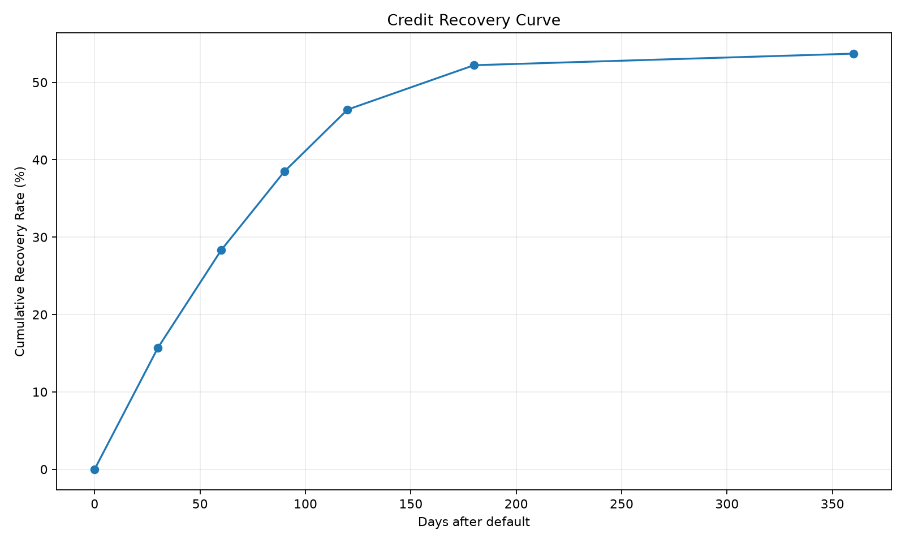
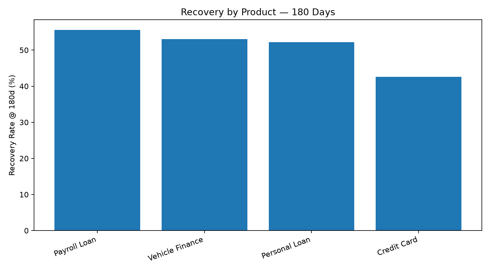
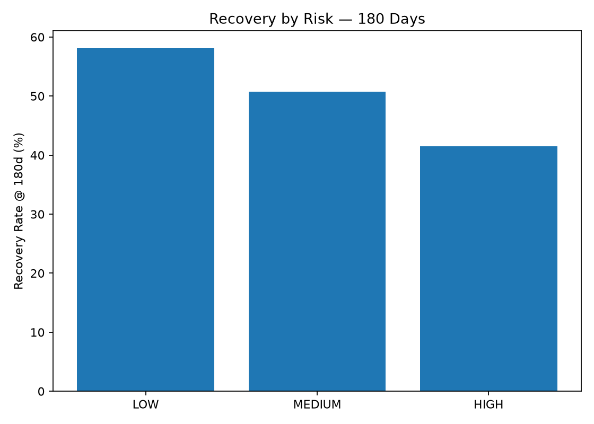
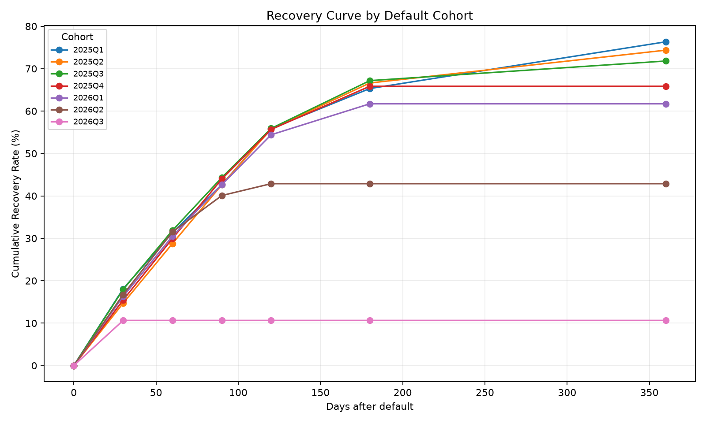

# Credit Recovery Analytics

**Python · Pandas · Credit Analytics · Recovery Curves · Cohort Analysis · Vintage Analysis · Pytest**

Projeto educacional de **Business Analytics aplicado a crédito**, desenvolvido com dados 100% sintéticos para analisar o comportamento de recuperação de uma carteira após o default.

> Nenhum dado real de clientes, contratos ou empresas é utilizado.

---

## 🔎 Problema

Analisar como uma carteira inadimplente recupera seu saldo ao longo do tempo e identificar diferenças entre **produtos, grupos de risco e safras**.

---

## 🔄 Pipeline

```text
Synthetic Data
      ↓
Data Quality
      ↓
First Default
      ↓
Exposure at Default
      ↓
Recovery Events
      ↓
Recovery Curve
      ↓
Product / Risk Analysis
      ↓
Cohort Analysis
      ↓
Vintage Analysis
      ↓
Business Insights
```

---

## 📊 Principais Resultados

| Indicador            |   Resultado |
| -------------------- | ----------: |
| Contratos em default |       5.978 |
| Exposure at Default  | R$ 68,06 mi |
| Recuperado           | R$ 36,55 mi |
| Recovery Rate @ 180d |      52,21% |
| Recovery Rate @ 360d |      53,71% |
| Tempo para 50%       |    180 dias |

### Recovery Curve

| Horizonte | Recovery Rate |
| --------: | ------------: |
|       30d |        15,68% |
|       60d |        28,30% |
|       90d |        38,47% |
|      120d |        46,48% |
|      180d |        52,21% |
|      360d |        53,71% |

---

## 💳 Recovery por Produto

| Produto         | Recovery @ 180d |
| --------------- | --------------: |
| Payroll Loan    |          55,62% |
| Vehicle Finance |          53,01% |
| Personal Loan   |          52,16% |
| Credit Card     |          42,60% |

---

## ⚠️ Recovery por Risco

| Risk Band | Recovery @ 180d |
| --------- | --------------: |
| LOW       |          58,15% |
| MEDIUM    |          50,78% |
| HIGH      |          41,53% |

> Resultados exclusivamente referentes ao dataset sintético.

---

## 📈 Visualizações









---

## 🧮 Métrica Principal

```text
Recovery Rate = Recovered Amount / Exposure at Default
```

O **Exposure at Default** é estimado a partir do valor das parcelas e do saldo programado após o primeiro default.

A definição possui finalidade **didática** e não representa metodologia regulatória.

---

## 🧠 Análises

* **Recovery Curve** — evolução da recuperação em diferentes horizontes.
* **Product Analysis** — comparação entre produtos.
* **Risk Analysis** — comparação entre faixas de risco.
* **Cohort Analysis** — comportamento das safras trimestrais.
* **Vintage Analysis** — recuperação mensal por maturidade.
* **Data Quality** — validações de consistência e unicidade.

---

## 🗂️ Estrutura

```text
Credit-Recovery-Curve/
├── data/
├── notebooks/
├── outputs/
├── src/
│   ├── analysis.py
│   ├── cohort_analysis.py
│   ├── data_cleaning.py
│   ├── data_generator.py
│   └── recovery_metrics.py
├── tests/
├── main.py
├── requirements.txt
└── README.md
```

---

## 🚀 Execução

```bash
python -m venv .venv
```

**Windows:**

```bash
.venv\Scripts\activate
```

Instale as dependências:

```bash
pip install -r requirements.txt
```

Execute:

```bash
python main.py
```

Testes:

```bash
pytest -q
```

---

## 🛠️ Stack

**Python · Pandas · NumPy · Matplotlib · Pytest · Jupyter**

Conceitos:

**Data Analytics · Credit Analytics · Data Quality · Recovery Rate · EAD · Segmentation · Cohort Analysis · Vintage Analysis**

---

## ⚠️ Limitações

* Dados totalmente sintéticos.
* EAD utilizado de forma didática.
* Não representa metodologia regulatória.
* Não inclui modelos preditivos ou estratégias de cobrança.

---

## 📌 Objetivo

Demonstrar um pipeline completo de:

**Data Analytics → Credit Analytics → Business Metrics → Segmentation → Temporal Analysis → Business Insights**

> Projeto educacional desenvolvido exclusivamente com dados sintéticos.
